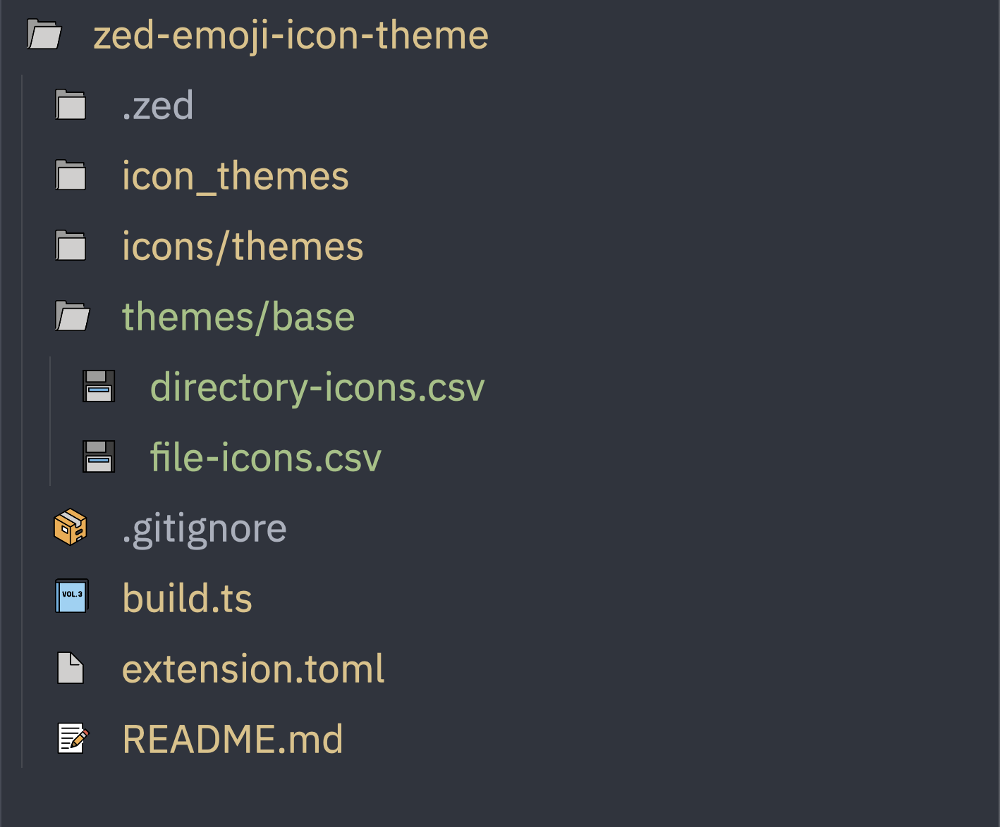

# OpenMoji Emoji Icons Theme

OpenMoji emoji icons for [Zed](https://zed.dev/)



## Themes

- Color
- Grayscale (Light)
- Grayscale (Dark)

## Build

Requires [Deno](https://deno.com/)

```bash
./build.ts
```

## Attribution

All emojis designed by [OpenMoji](https://openmoji.org/) – the open-source emoji
and icon project. License:
[CC BY-SA 4.0](https://creativecommons.org/licenses/by-sa/4.0/#)

- Dark theme grayscale emojis have had their colors and opacities adjusted.
